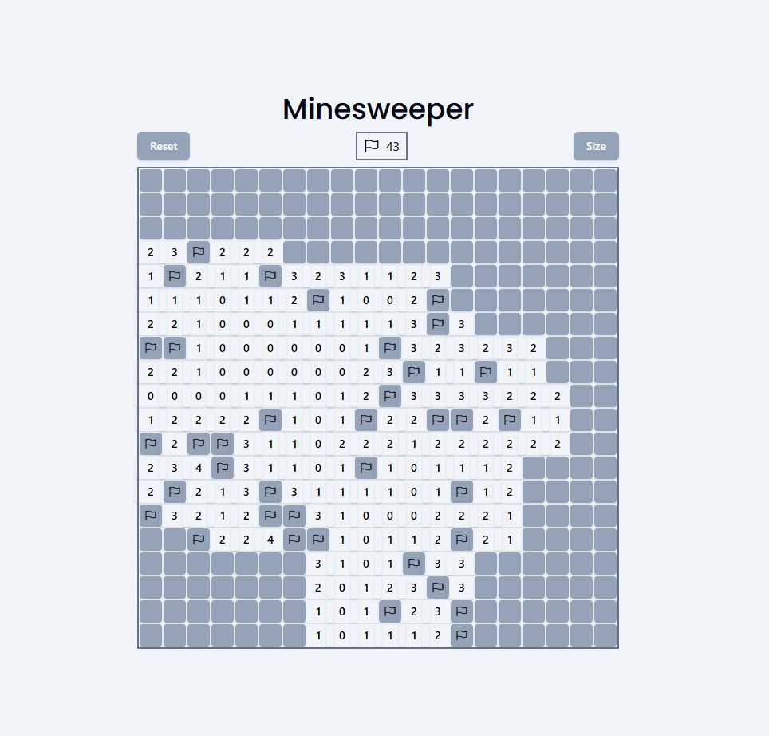

# Minesweeper

A simple recreation of Minesweeper to test out new technologies like Svelte.

Tech Stack: Svelte 5, Tailwind CSS, Shadcn-svelte

Node version: 22.13.0

## Demo photo

## Interesting problems encountered during development

Vite's hmr will not work if VScode is opened in Windows, but the code is ran using WSL.
Decided to work with the recommended solution on Vite's website.

https://v3.vitejs.dev/config/server-options.html#server-watch